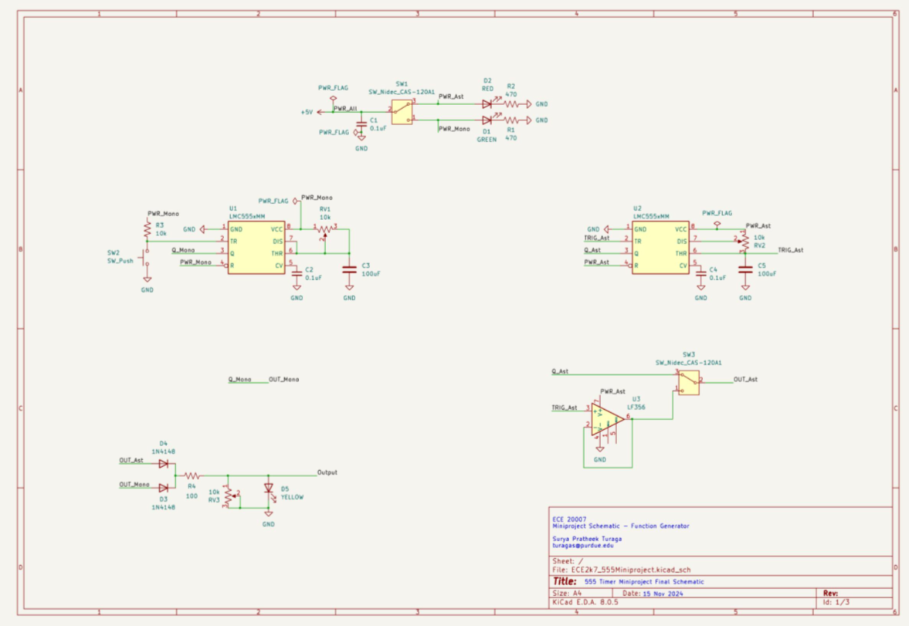
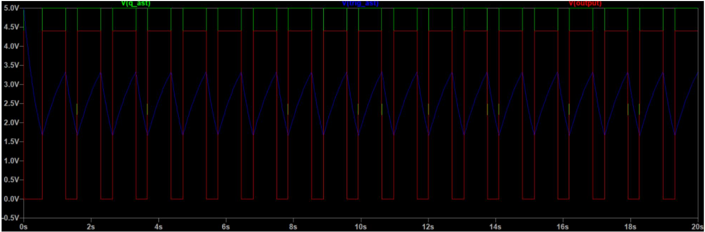
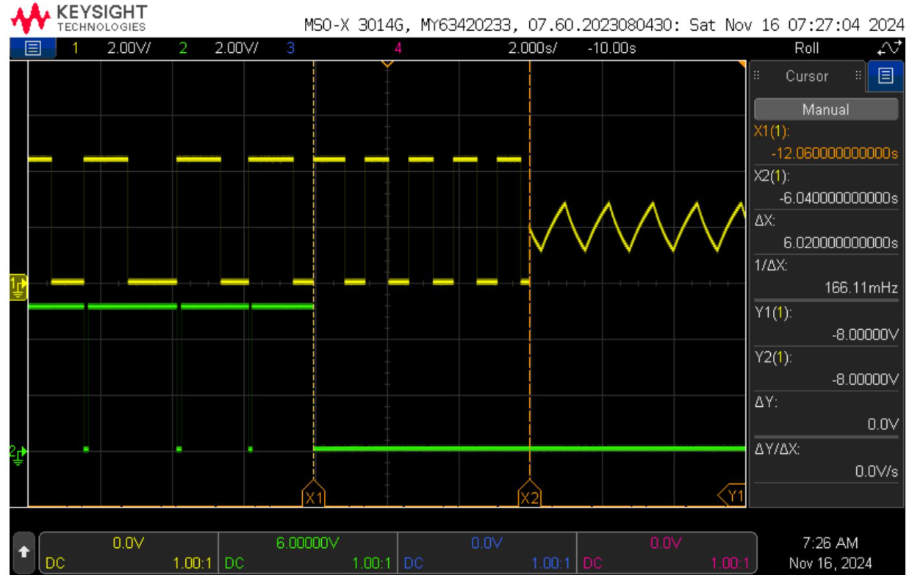
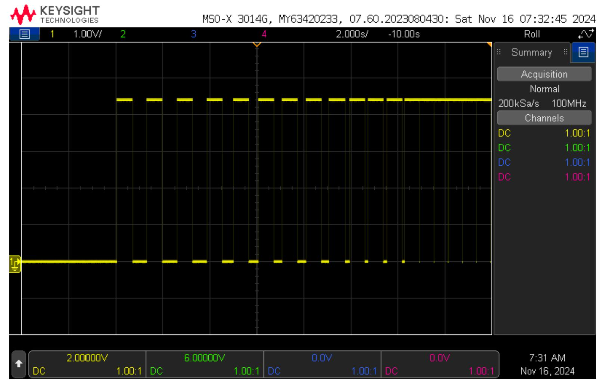

# Function Generator

This is a 555 timer based project that allows generation of pulses, rectangular waves, and swtooth waves, all adjustable with 10k potentiometers.

*Breadboard wiring of function generator*

*KiCad schematic of generator.*

*Astable LTSpice simulation*

*Toggling modes of output.*

*Adjusting frequency and duty cycle.*
