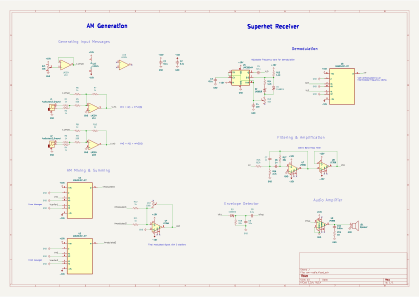
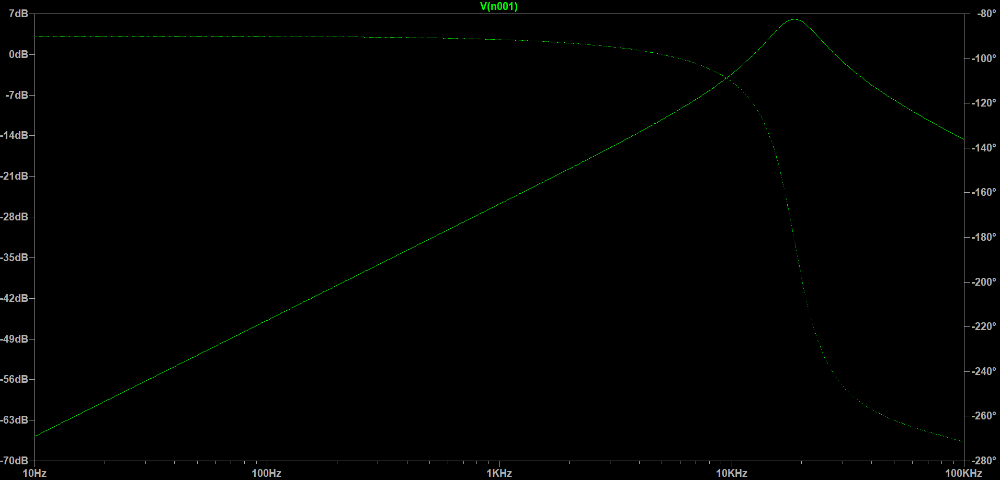
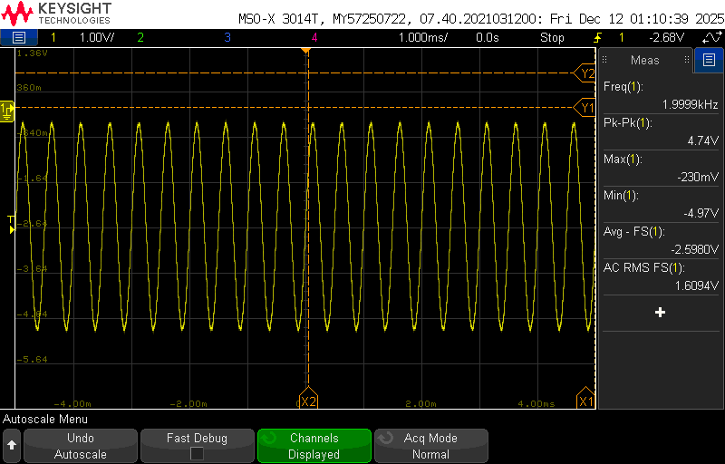
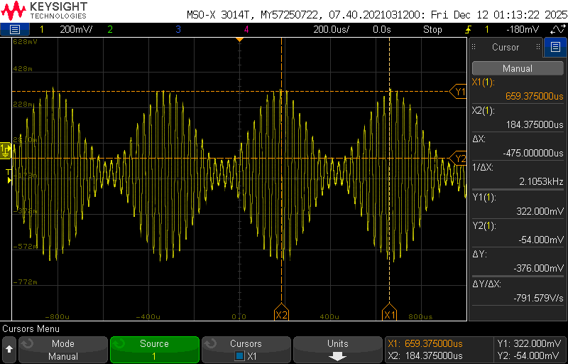
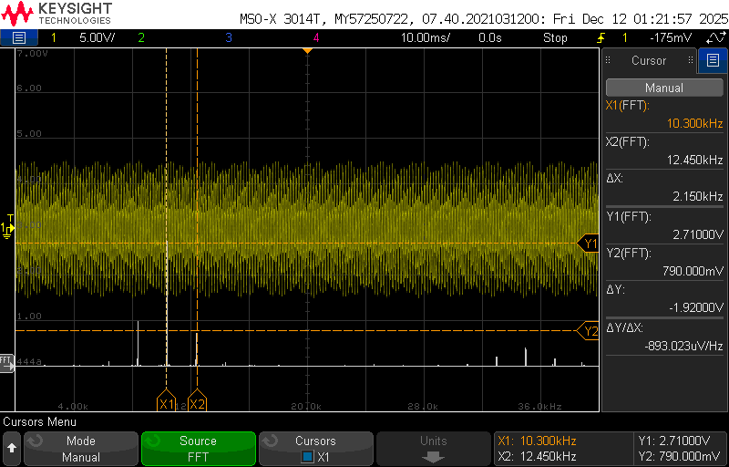
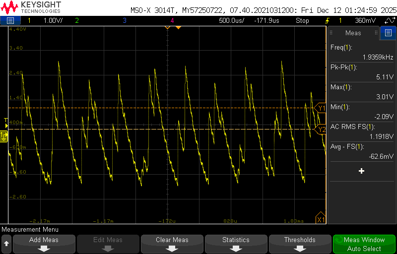

# Am Radio

This project is a simple demonstration of AM signal transmission and receiving. It makes use of AD633 analog multiplier ICs for all mixing and demodulating, and the superhet receiver makes use of an LMC555 timer for the local oscillator.

*Schematic for the complete project*

The circuit has 2 AUX inputs which are converted to mono audio, and then shifted and scaled. 10k potentiometers allow for exact tweaking of shifting and modulation index to allow proper signal generation.

$$ v_{mi} = A \cdot (1 + m \cdot v_{i}(t)) $$

Analog multipliers mix the two signals to produce individual AM signals. The mixing frequencies need to be chosen appropriately, but 50kHz and 80kHz will work. Finally, they are added to produce one AM signal with two 'stations' that the reciever can tune in to.

The receiver first has an LMC555 timer circuit with adjustable frequency between 5kHz and 50kHz. A clever arrangement of 1N5819 Schottky Diodes allows the circuit to maintain 50% Duty Cycle. The signal is mixed with the AM signal to low side inject the signal into 10kHz IF, where a multiple feedback BPF amplifies the needed part. 

*BPF LTSpice FRA.*

An envelope detector then allows reconstruction of the original signal, which is connected to the speaker using an LM386 audio amplifier.

*Final circuit breadboard.*

*Original test signal.*

*Amplitude Modulated signal.*

*FFT of demodulated and filtered signal.*

*Reconstructed sine wave.*

The final signal was still noisy partly due to the slow LM324 and the use of a square wave demodulator. Some finer tuning after the envelope detector could help. The signal to noise ratio was measured at 5.19, which can be acceptable.
